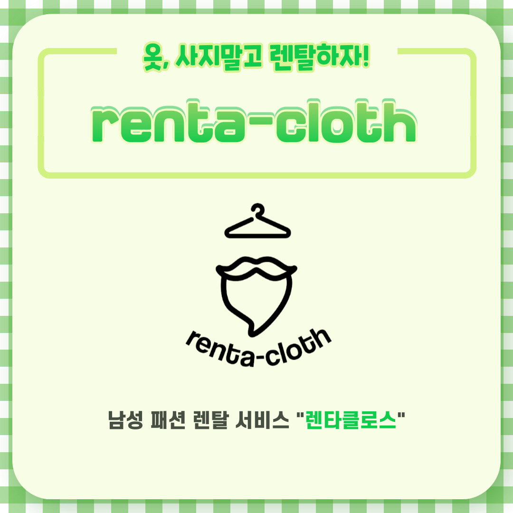
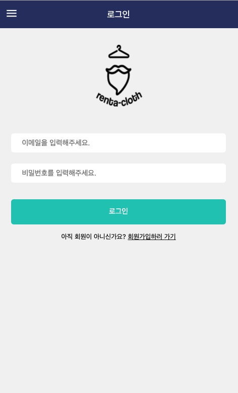
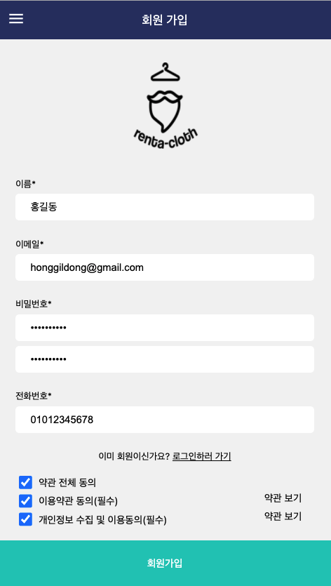
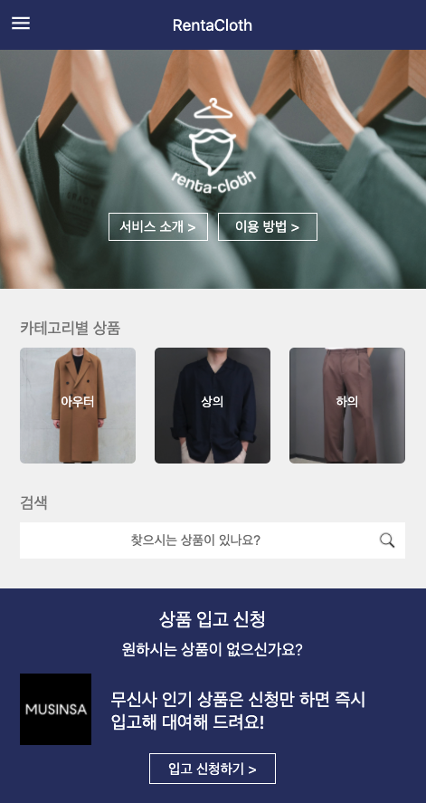
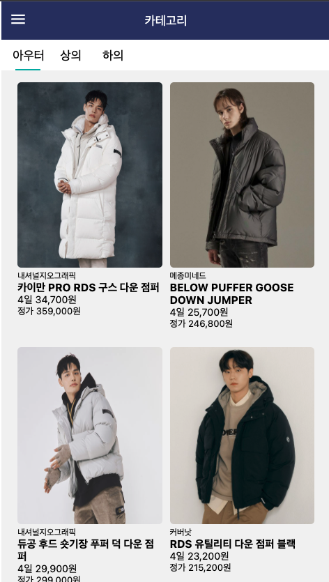
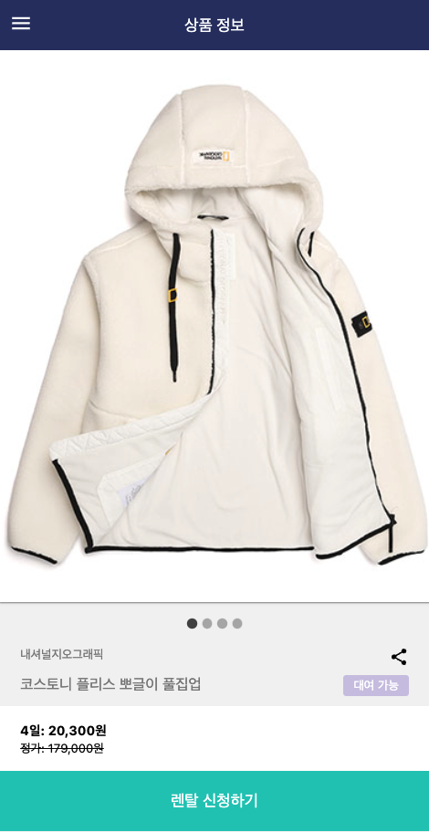
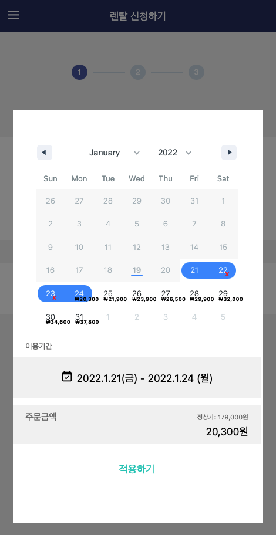
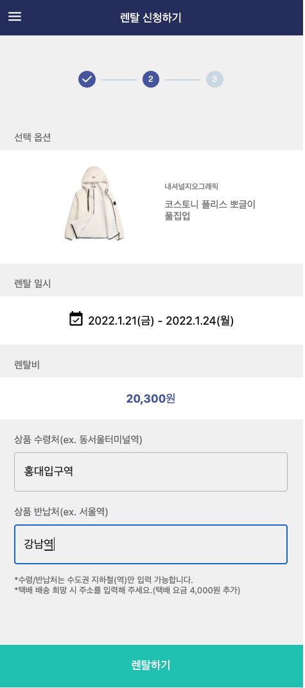
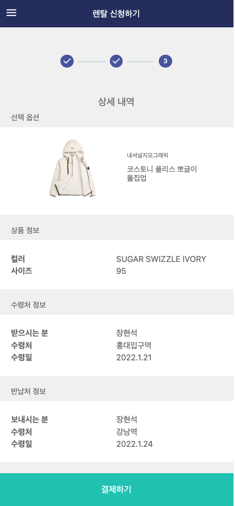

# 렌타클로스 - 남성 브랜드 의류 대여 서비스

  
  
  
  
    

## 🎅 렌타클로스 서비스 소개

Link: https://rentacloth.net

### 🧥 렌타클로스는 남성들은 위한 패션 의류 렌탈 서비스입니다.  원하는 옷을 예약하고 인근 지하철역 물품 보관함에서 즉시 제품을 받아보세요.

_q: 어떤 의류 상품들을 대여할 수 있나요?_ 
**A: 렌타클로스에서 제공하는 제품들은 20대 남성들이 가장 선호하는 무신사의 월간 베스트 브랜드 제품들로 직접 사입하고 있습니다.**

_q: 얼마 동안 대여할 수 있나요?_ 
**A: 제품은 수령일로부터 최소 4일 ~ 최대 11일까지 이용하실 수 있어요. 대여 일수가 길어질수록 하루 평균 대여비가 저렴합니다.**

_q: 의류 관리는 어떻게 하고 있나요?_ 
**A: 렌타클로스의 모든 의류는 국내 세탁 업계 1위 크린토피아 청량리한신점과의 제휴를 통해 고품질의 세탁 과정을 거칩니다.**

## 🏅 수상 경력

> 1. 2021 Startup Express Summer Season 대상
> 2. 2021 KU Campus CEO 장려상
> 3. 2021 고려대학교 캡스톤 디자인 경진대회 장려상
> 4. 2021 K-스타트업 학생 창업 유망팀 300 선정
> 5. 2021 고려대학교 창업동아리 지원사업 선정

## 📚 기술 스택

-   개발 언어: JavaScript, Typescript
-   개발 라이브러리: React
-   SSR 프레임워크: Next.js
-   상태관리 :
    -   Context API
    -   Redux (in progress)
-   배포 :
    -   AWS S3 : 서버리스 서비스를 통해 배포를 하기 위해 사용
    -   AWS Cloudfront : HTTPS 적용을 위해 사용
-   통신 : Axios
-   UI: MUI
-   라이브러리(패키지) :
    -   react-date-range: 캘린더 기능
    -   next-pwa: 웹을 PWA로 전환
-   분석 툴:
    -   Hotjar: 웹 로그, 히트맵
    -   Google Analytics: 방문자

## 📌 주요 기능

로그인 페이지

JWT 토큰 방식으로 토큰을 발급받고 LocalStorage에 저장하여 사용한다.

</img>

회원가입 페이지

- 로그인할떄 사용할 이메일과 비밀번호, 그리고 알림톡을 위한 연락를 설정한다. 
- 필수 이용약관 동의를 요청한다.

</img>

메인 페이지

메인 페이지는 다음과 같은 영역으로 나뉜다.  
- 최상단: 서비스 소개나 이용 방법 페이지로 이동하는 버튼이 있다.  
- 카테고리별 상푼: 각 카테고리의 상세 페이지로 이동한다. 
- 검색: 검색어를 입력하면 일치하는 제품 혹은 브랜드의 제품들은 불러온다.  
- 최하단: 카카오톡 비즈니스 채널로 연결해준다.  

</img>

카테고리 상세 페이지

- 아우터, 상의, 하의에 속하는 제품들을 나열한다. 
- 제품 마다 이름, 브랜드, 4일 기준 렌탈 가격, 그리고 정가를 표기한다.  
- 썸네일은 무신사와 동일한 이미지를 사용한다. 
- 썸네일 클릭 시 해당 제품 상세 페이지로 이동한다.  

</img>

제품 상세

- 캐러셀을 이용해 기존 썸네일을 포함한 해당 제품의 모든 이미지를 보여준다. 
- 유저의 로그인 상태에 따라 하단 CTA 색상이 변한다.  
- 로그인한 상태에서 하단 CTA 클릭 시, 사이즈와 색상을 고르는 CTA가 나온다.  
- 아직 로그인을 안한 상태에서 CTA 클릭 시, 로그인 안내 모달이 나오도록 한다. 

</img>

캘린더 페이지 (렌탈 신청 페이지 1)

- 사용자가 제품 수령일과 반납일을 설정한다. 
- 수령일은 금일에서 최소 이틀 후 부터 선택이 가능하다. (오늘이 1일이면 -> 3일부터 수령 가능) 
- 반납일은 수령일부터 최소 4일에서 최대 11일까지 선택이 가능하다. 
- 페이지 최초 렌더링 시 디폴트로 수령일은 금일부터 이틀 후, 반납일은 수령일 부터 4일 후로 설정한다.   
- 수령일과 반납일을 설정하면 렌탈 신청 페이지 2로 이동한다.  

</img>

렌탈 신청 페이지 2 & 3

- 렌탈 신청 페이지 2 에서는 제품을 수령하고 반납할 지하철 역을 입력한다.   
- 렌탈 신청 페이지 3 에서는 모든 렌탈 정보를 취합하고 확인을 요청한다. 

</img>
</img>

